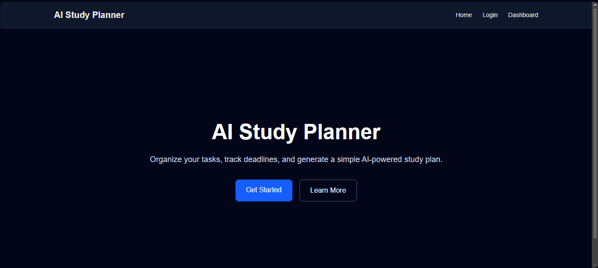
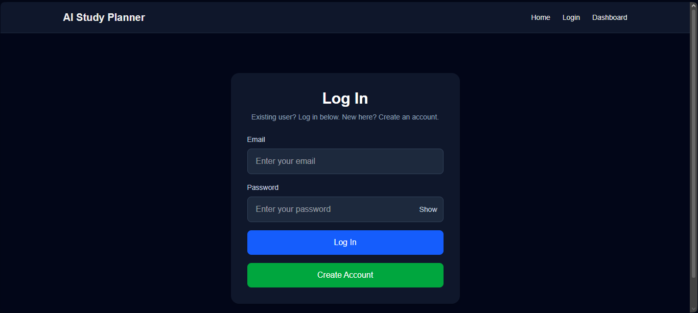
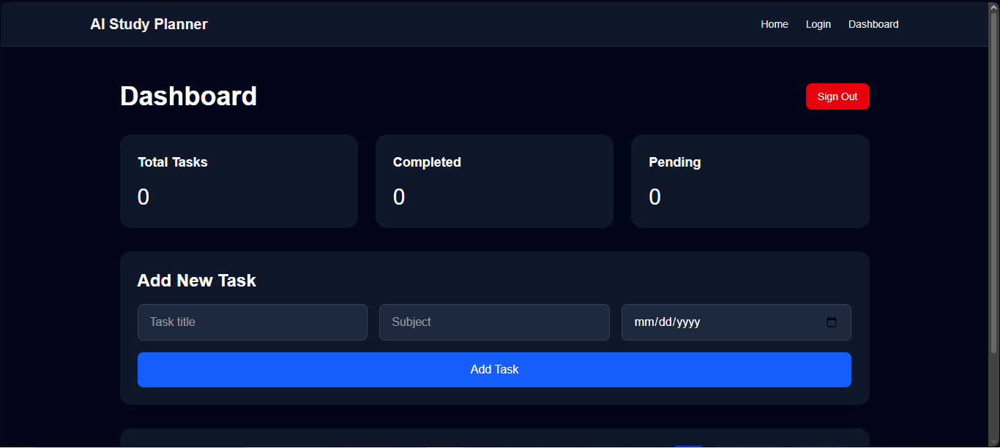

# AI Study Planner

AI Study Planner is a full-stack study task management web app built with Next.js, Supabase, and Vercel. Users can create an account, log in, and manage their own study tasks with real database storage.

## Live Demo
[View Live App](https://ai-study-planner-khaki-alpha.vercel.app)

## Features
- User authentication with Supabase
- Create account and log in
- Add new tasks
- Edit tasks
- Mark tasks as completed
- Delete tasks with confirmation
- Filter tasks by All, Completed, and Pending
- User-specific task storage
- Persistent data across sessions
- Responsive dark-themed interface

## Tech Stack
- Next.js
- React
- TypeScript
- Tailwind CSS
- Supabase
- Vercel

## Screenshots

### Home Page


### Login Page


### Dashboard


## How to Run Locally

1. Clone the repository
2. Install dependencies

```bash
npm install